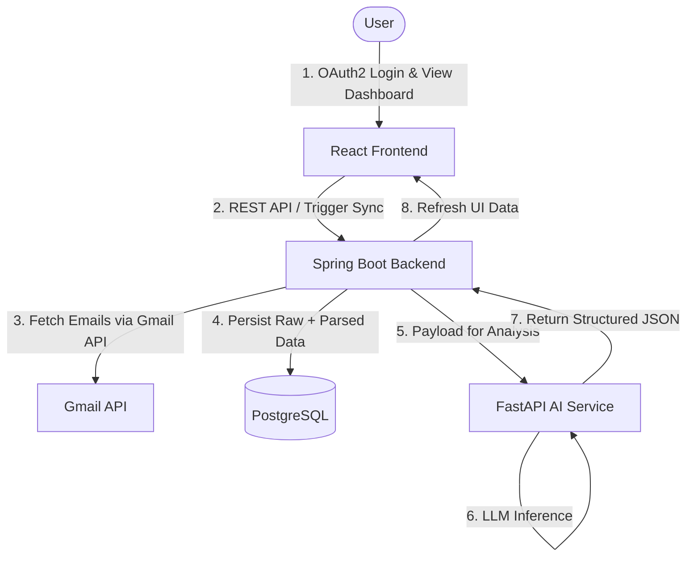
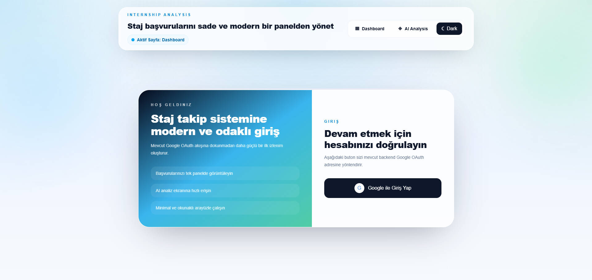
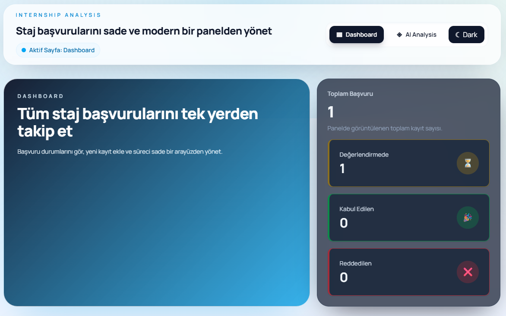
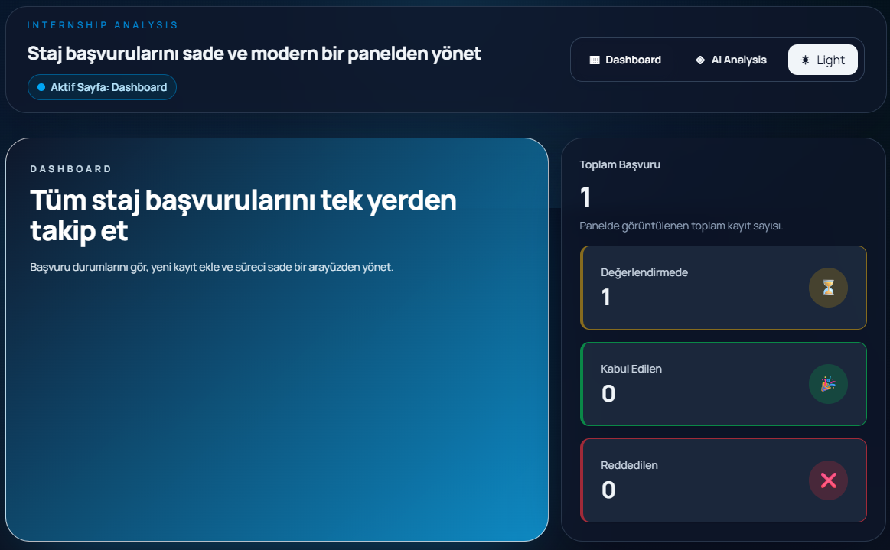
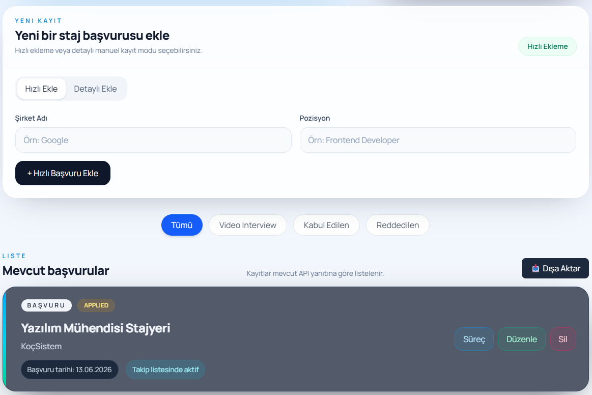
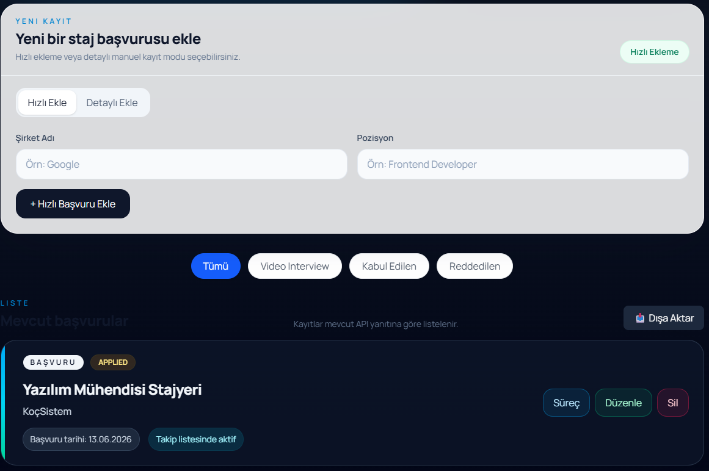
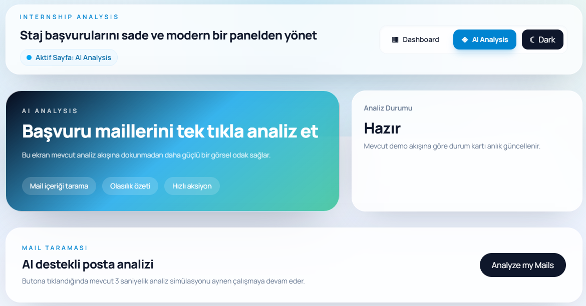

# Internship Analysis - Showcase Hub

A showcase repository that ties together the Backend, AI Service, and UI for an internship application tracking platform. This hub explains how the pieces fit and links to the dedicated repos for each service.

## What This System Solves

High-volume application emails are messy and inconsistent. This system normalizes those emails into structured records and surfaces them in a clean dashboard so users can track applications, statuses, and progress.

## Architecture Summary

- UI handles login and user actions.
- Backend performs OAuth2, Gmail sync, persistence, and orchestration.
- AI service parses emails into normalized JSON.

## Data Flow



## Local Folders

This repo mirrors all three services for a single-workspace showcase:

- [internshipanalysis-backend](internshipanalysis-backend)
- [ai-service](ai-service)
- [internship-analysis-ui](internship-analysis-ui)

## Setup (Local)

### Prerequisites

- Java 21 + Maven
- Node.js 18+
- Python 3.10+
- PostgreSQL

### Environment

Use the shared template in [.env.example](.env.example).

### Backend

```bash
cd internshipanalysis-backend
./mvnw spring-boot:run
```

### AI Service

```bash
cd ai-service
python -m pip install fastapi uvicorn python-dotenv google-generativeai
uvicorn src.main:app --reload --port 8001
```

### UI

```bash
cd internship-analysis-ui
npm install
npm run dev
```

## Screenshots

### Login



### Dashboard

| Light Mode | Dark Mode |
|---|---|
|  |  |

### Internship List

| Light Mode | Dark Mode |
|---|---|
|  |  |

### AI Analysis

