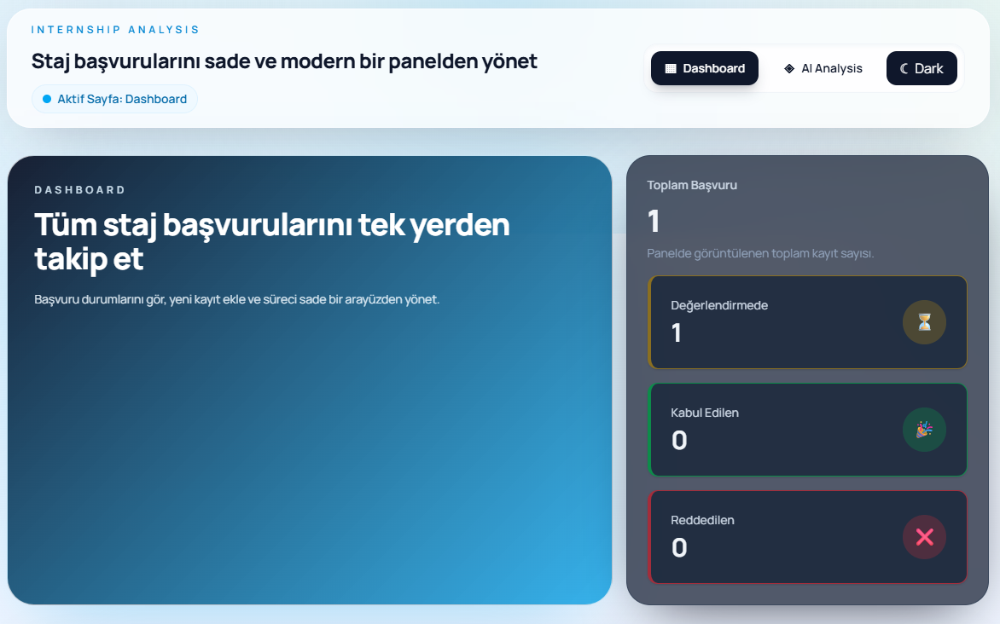
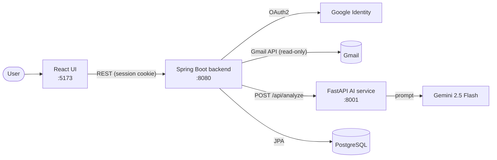
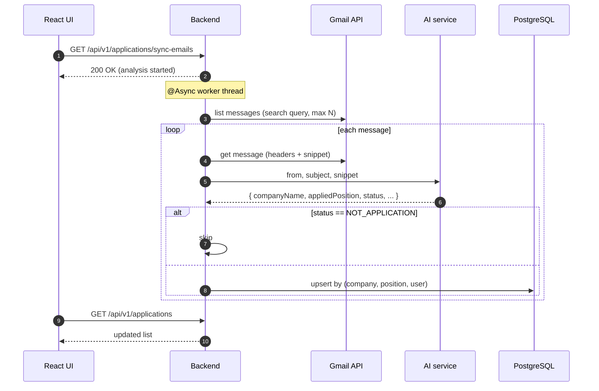
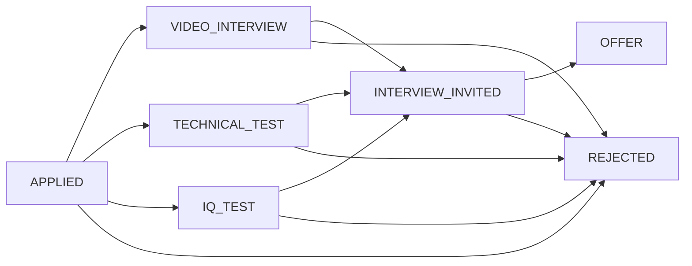
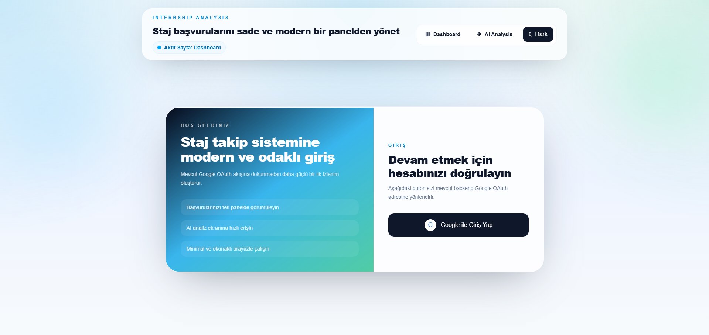
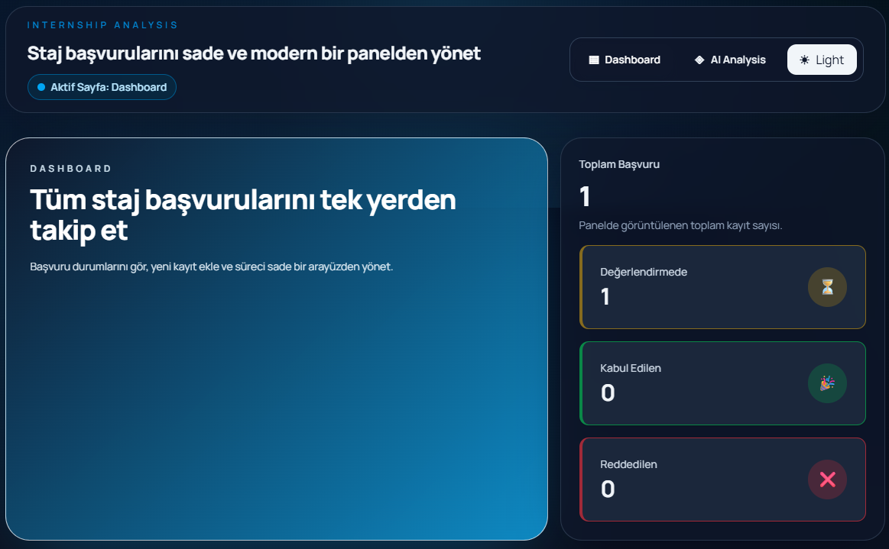
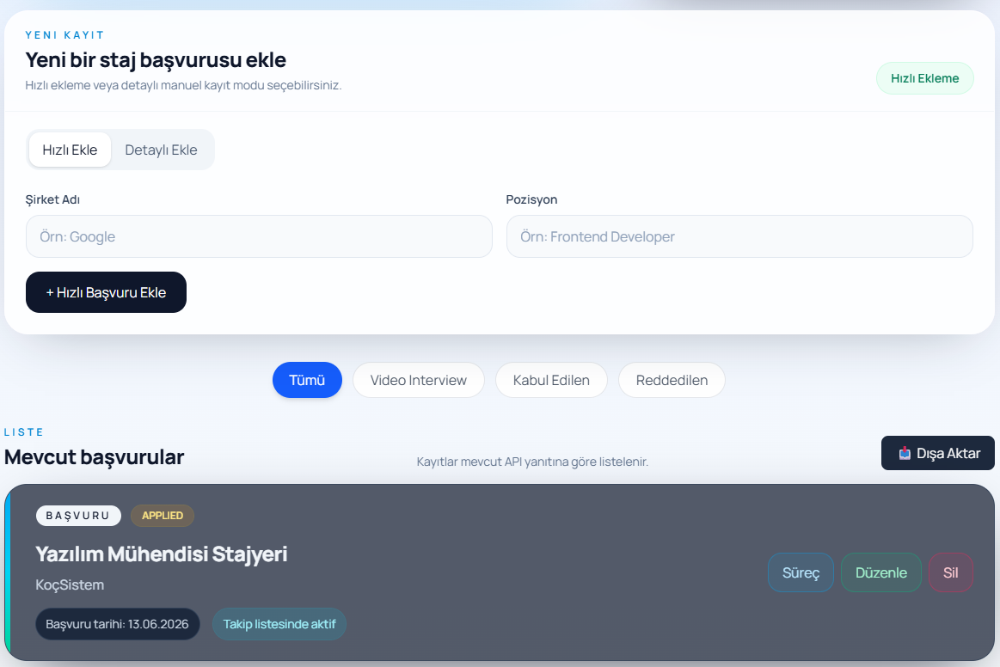
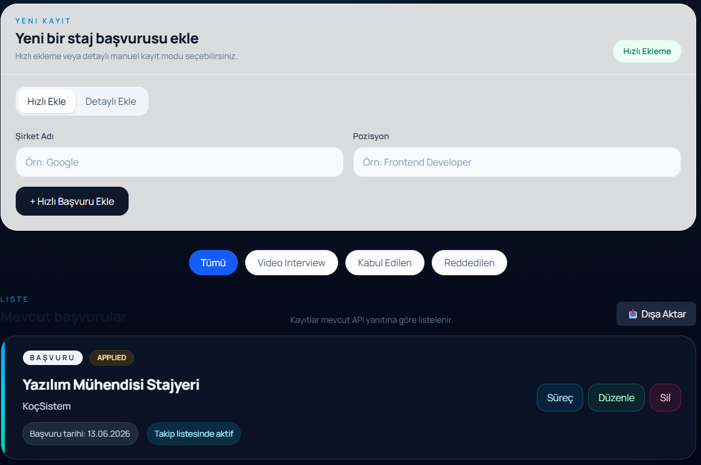
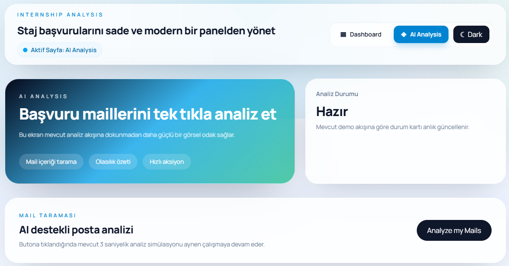

<div align="center">

# Internship Analysis

**An AI-powered internship application tracker that builds itself from your Gmail inbox.**




</div>

## The Problem

Students applying to dozens of internships end up with confirmations, test invites, interview links and rejections scattered across their inbox. Tracking them in a spreadsheet is tedious and quickly goes out of date.

**Mail Analysis** connects to the user's Gmail account and has an LLM read every application-related email. It turns each email into a structured record and keeps every application's status current on a single dashboard.

## Features

- **One-click Gmail sync.** Sign in with Google and press *Analyze my Mails*. Relevant emails are fetched and analyzed in the background.
- **LLM-based classification.** Gemini extracts the company, position and internship type, and assigns one of eight pipeline stages, from `APPLIED` to `OFFER`.
- **Normalization.** Legal suffixes like "A.Ş." and "Inc." are stripped, and boilerplate like "Stajyer" and "Intern" is removed, so the same company always appears under one name.
- **Self-updating records.** A new email about an existing application moves it forward instead of creating a duplicate.
- **Manual edits are preserved.** When a user edits a record by hand, later syncs only update its status.
- **Manual tracking.** Applications that never reached the inbox can be added in a quick or a detailed mode.
- **Dashboard.** Shows status counters, filters, an Excel export, and light and dark themes.

## Repositories

The system is split into three independently deployable services:

| Repository | Role | Stack |
|------------|------|-------|
| [**mail-analysis**](https://github.com/hasanerzz/mail-analysis) | Backend: OAuth2, Gmail sync, persistence, orchestration | Java 21, Spring Boot 4, Spring Security, JPA, PostgreSQL |
| [**mail-analysis-ai-service**](https://github.com/hasanerzz/mail-analysis-ai-service) | Email classification and normalization | Python, FastAPI, Pydantic, Gemini 2.5 Flash |
| [**mail-analysis-ui**](https://github.com/hasanerzz/mail-analysis-ui) | Web client | React 19, Vite, Tailwind CSS, Axios |

This repository holds the system-level documentation and screenshots.

## Architecture


```mermaid
flowchart LR
    User([User]) --> UI["React UI<br/>:5173"]
    UI -- "REST (session cookie)" --> BE["Spring Boot backend<br/>:8080"]
    BE -- OAuth2 --> Google[Google Identity]
    BE -- "Gmail API (read-only)" --> Gmail[(Gmail)]
    BE -- "POST /api/analyze" --> AI["FastAPI AI service<br/>:8001"]
    AI -- prompt --> LLM[Gemini 2.5 Flash]
    BE -- JPA --> DB[(PostgreSQL)]
```

### Sync flow


```mermaid
sequenceDiagram
    autonumber
    participant UI as React UI
    participant BE as Backend
    participant G as Gmail API
    participant AI as AI service
    participant DB as PostgreSQL

    UI->>BE: GET /api/v1/applications/sync-emails
    BE-->>UI: 200 OK (analysis started)
    Note over BE: @Async worker thread
    BE->>G: list messages (search query, max N)
    loop each message
        BE->>G: get message (headers + snippet)
        BE->>AI: from, subject, snippet
        AI-->>BE: { companyName, appliedPosition, status, ... }
        alt status == NOT_APPLICATION
            BE->>BE: skip
        else
            BE->>DB: upsert by (company, position, user)
        end
    end
    UI->>BE: GET /api/v1/applications
    BE-->>UI: updated list
```

### Design decisions

- **The AI runs as a separate service.** The LLM provider and the prompt can change without redeploying the backend, and the Python ecosystem is the natural fit for LLM work.
- **Sync is asynchronous.** Analyzing dozens of emails with an LLM takes several seconds. The endpoint returns right away and the work runs on a dedicated thread pool.
- **Records are upserted by (company, position, user).** Every email in an application's lifecycle updates the same record, so the dashboard shows each application's current stage.
- **Manual edits are protected.** An `isManuallyEdited` flag keeps user-entered data from being overwritten by AI output.
- **Failures fail safe.** If the LLM returns an unparseable answer, the AI service returns `NOT_APPLICATION`, so bad data never reaches the database.

## Application Lifecycle


```mermaid
flowchart LR
    APPLIED --> VIDEO_INTERVIEW
    APPLIED --> TECHNICAL_TEST
    APPLIED --> IQ_TEST
    VIDEO_INTERVIEW --> INTERVIEW_INVITED
    TECHNICAL_TEST --> INTERVIEW_INVITED
    IQ_TEST --> INTERVIEW_INVITED
    INTERVIEW_INVITED --> OFFER
    APPLIED & VIDEO_INTERVIEW & TECHNICAL_TEST & IQ_TEST & INTERVIEW_INVITED --> REJECTED
```

The AI is instructed to pick the most advanced stage an email shows. Emails that are not about an application, such as newsletters or password resets, are labeled `NOT_APPLICATION` and discarded.

Example AI service output:

```json
{
  "companyName": "Ford Otosan",
  "appliedPosition": "Software Engineering",
  "status": "TECHNICAL_TEST",
  "gmailMessageId": "197ac6f42b8d9e01"
}
```

## Screenshots

### Sign-in



### Dashboard

| Light | Dark |
|---|---|
|  |  |

### Applications

| Light | Dark |
|---|---|
|  |  |

### AI analysis



## Running Locally

### Prerequisites

- Java 21, Python 3.10+, Node.js 18+, PostgreSQL
- A Google Cloud OAuth 2.0 client with the **Gmail API** enabled, and `http://localhost:8080/login/oauth2/code/google` as an authorized redirect URI
- A [Gemini API key](https://aistudio.google.com/app/apikey)

### 1. Clone the services

```bash
git clone https://github.com/hasanerzz/mail-analysis.git
git clone https://github.com/hasanerzz/mail-analysis-ai-service.git
git clone https://github.com/hasanerzz/mail-analysis-ui.git
```

### 2. AI service (port 8001)

```bash
cd mail-analysis-ai-service
echo "GEMINI_API_KEY=your-key" > .env
pip install fastapi uvicorn python-dotenv google-genai
cd src && uvicorn main:app --reload --port 8001
```

### 3. Backend (port 8080)

```bash
cd mail-analysis
cp .env.example .env    # fill in Google OAuth and database credentials
createdb mailanaliz_db
./mvnw spring-boot:run
```

### 4. UI (port 5173)

```bash
cd mail-analysis-ui
npm install
npm run dev
```

Open `http://localhost:5173` and sign in with Google.

## Testing

The backend has JUnit 5 tests on several layers:
- Unit tests with Mockito for the business logic, including the upsert and manual-edit rules
- Web-slice tests with MockMvc and Spring Security Test for the REST endpoints and OAuth2 authentication
- JPA-slice tests on H2 for the repositories

The tests don't need any external service:

```bash
cd mail-analysis && ./mvnw test
```

## Security & Privacy

- Gmail access is **read-only** (`gmail.readonly` scope).
- Only the sender, subject and a short snippet of each email are sent for analysis. Full email bodies are never stored.
- All credentials are supplied through environment variables. None are committed to the repositories.
